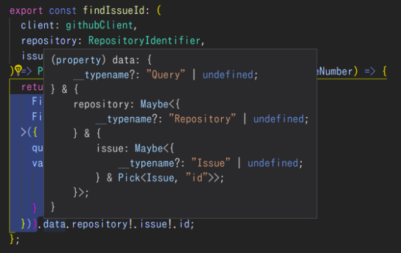
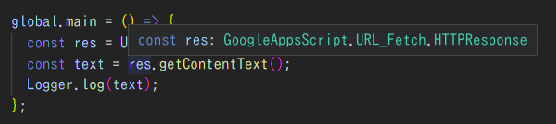

## Github × Google Form

---

## 自己紹介

- 張 たいよ
- 東大理学部 物理学科4年
- 駒場祭委員会（2016.4〜2017.12）
- 五月祭常任委員会（2018.1〜2019.5）
  - インフラ管理やバックエンド
- venstus (2017.11〜)
  - フロントエンドの全体設計を主にやっている

---

## 動機1. 実用的な問題

- スマホからGithubのIssueを書くのはめんどくさい！（UIがあまりよろしくない）
- フォーマットに従って書くのが地味に面倒

!!!


## 動機2. かねてから思ってたこと

- Google Apps Scriptを効率的に書きたい
- Google Apps Scriptで一般的な処理を行いたい
- GraphQLにいい加減触ってみたい

---

## 構成

### 前編: Github (GraphQL)

### 中編: Google Form (GAS)

### 後編: Github ✕ Google Form

（[サンプルリポジトリ](https://github.com/neutron63zf/gform_github_sample)もあるのでよければぜひ）

---

## 前編: Github (GraphQL)

---

### 目標

GitHubの特定のIssueに文字列コメント（引数）を追加する関数

---

### GraphQLは何がうれしいのか?

!!!

RESTだと...

- 「これどのエンドポイントだっけ」問題
- 「これの形式 is 何?」問題
- 欲しい情報を得るために複数回リクエスト

!!!

これらを

**「フロントでデータ形式を指定してリクエストする」**

ことで解決する

```
query {
  repository(owner:"octocat", name:"Hello-World") {
    issues(last:20, states:CLOSED) {
      edges {
        node {
          title
          url
          labels(first:5) {
            edges {
              node {
                name
              }
            }
          }
        }
      }
    }
  }
}
```

（最新の20個の閉じてるissueのタイトル,URL,名前）

---

### やる前の印象

（巷にあふれる記事を読んだあと）

- 難しそうな用語がたくさんあって難しそう
  - query,mutation,subscriptio,schema...
- 毎回クエリを構築するの大変そう

---

### GraphQLのコア

- 使うだけならquery（取得）とmutation（変更）だけで困らない

!!!

#### query/mutationとは

- queryは何か情報を取得したいときに使う
- mutationは何か変更を加えたいときに使う

!!!

大まかには、

- queryはGET
- mutationはPOST, PUT, DELETE

と考えるとよい

!!!

#### query/mutationを書くには

!!!

最初は**何が書けるのか?を意識しながら**の方が書きやすい

```
# mutationの場合は、「query」の部分が「mutation」になる
query findIssueComments {
  # 絞り込みたい場合はこんなふうに引数で指定できる
  repository(owner: "neutron63zf", name: "issue_comment_test") {
    issue(number: 3) {
      id
    }
  }
}
```

オブジェクトには型があるので、書けるものは限られる

（queryの中に直接issueは書けない、とか）

GitHubの場合、[リファレンス](https://developer.github.com/v4/query/)の「Fields」と「Connections」のところに指定できる一覧が書かれている

!!!

```
query findIssueComments($owner: String!, $name: String!, $number: Int!) {
  repository(owner: $owner, name: $name) {
    issue(number: $number) {
      id
    }
  }
}
```

こんなふうに引数をとれるようにすることで、クエリの再利用も簡単にできる。

!!!

### node.jsでGraphQLを使う

- [Apollo-Client](https://github.com/apollographql/apollo-client/blob/master/README.md)というライブラリが便利
- クエリを別管理してimportすることもできる
- [Graphql Codegen](https://graphql-code-generator.com/)を使うと、レスポンスの型の補完も効くようになる



---

## 中編: Google Form (GAS)

!!!

### GASでめんどくさいところ

- ウェブエディタが必要
  - 補完はできるがコードのgit管理とかができない
- ES2015が使えない
  - class,let,アロー関数全てだめ
  - 書きづらい
- 全ファイルが同じ名前空間上にいる

!!!

### 目標

- ローカルでコードを書く（補完つき）
- ES6+やtypescriptで書く
- import/exportをちゃんと効かせる

---

### clasp

- アップロードをワンコマンドでやってくれる
- typescriptの場合は自動でトランスパイルもしてくれる
- 型定義をnpmで入れれば補完も効く

[(ClaspのGitHub)](https://github.com/google/clasp/blob/master/README.md)



（レスポンスに型がついている様子）

!!!

### claspの問題点

- typescriptのトランスパイルがガバガバすぎる
- [色々ある](https://qiita.com/nazoking@github/items/5689ba7d27d4cdfda8f5)が、最大の問題点はimportが死ぬところ

具体的には、「`import { a as b }`」が単にコメントアウトされるだけ。

!!!

### 結局どうするか

claspでアップロードする前にwebpackを使ってトランスパイル・バンドルする

---

## 後編: Github ✕ Google Form

!!!

### 目標

- フォームの送信をトリガーにissueを投稿する
- GASのトリガーで可能なかぎり一般的な処理を書く方針を見つける

!!!

### 当初の作戦

- GASでは、「フォームが送信をトリガーに起動する関数」を指定できる
- その中で、前編で作った関数を呼び出す
- webpackでES3にトランスパイルしてバンドルして変換する
- claspでアップロード

!!!

### ところが...

- GASだといろいろな関数が足りない
  - globalもwindowも無いので吐き出されたコードが死ぬ
  - npmパッケージが前提としてるオブジェクトもないので死ぬ
    - fsはない（当たり前）
    - fetchもXHRもなく、URLFetchAppとかいう謎のものしかない
    - 型の互換性もない

!!!

### GAS上で動く処理の限界

事実上、npmパッケージのかなりの部分は使えない

- 今回のケースでは可能だが、一般的な処理は望むべくもない
- 内部で依存してるオブジェクトのpolyfillを毎回書くのは事実上不可能
  - fsとかfetchとか
  - 全体的にIO系はとても厳しい
- なんとか書けたとしても型定義などを自作する必要あり

!!!

### 最終的な構成

- githubにコメントを送るwebサーバーをherokuで立てておく
- GASからはそのサーバーにリクエストを送る

!!!

### 結論

- GASでの処理は最低限にせざるを得ない
- ライブラリも型による補完もあきらめるか、別サーバー立てるか

---

## まとめ

- 使うだけならGraphQLはそんな難しくない
  - query, mutationだけで事足りる
  - Apollo-Clientは便利

- GASでやる処理は最低限に
  - webpackでバンドルしてからclaspで上げよう
  - npmパッケージは基本使えない

---

## サンプルリポジトリ（再掲）

https://github.com/neutron63zf/gform_github_sample
